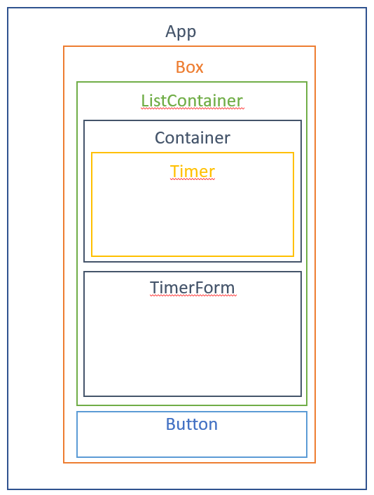

# ReactCourse

This project follows the course given by FlexCode on YouTube and the aim is to discover React's library.
This code displays few timers and gives the opportunity to the user to create/modify/delete timers. 

The Architecture of the code follows the following page's skeleton :

  

To run the project, make sure you've got npm installed on your computer (you can check it by running "npm --version" on your Windows command-line tool).  
Navigate to the reactcourse folder of the project in a command-line tool and then type : npm start  
It will launch your project on a local server and bring you to the localhost web page of your favourite web browser.
